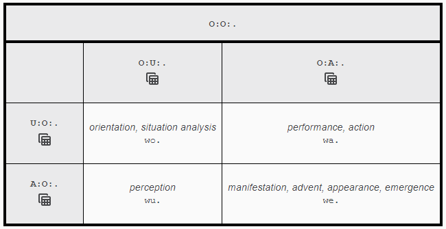
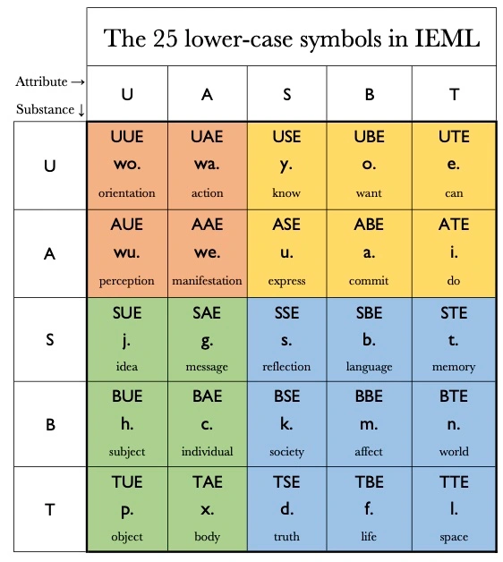
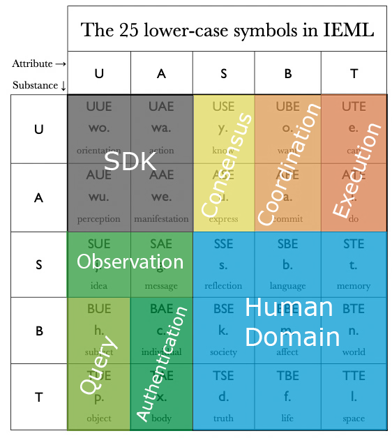

# Ask Finance Strategy Development Kit (SDK)

The AskFi SDK is a library of types written in F# backed by an ontology defined in IEML.

The ontology defines the trading systems abstract data model.

The code library provides the necessary interface types to built strategy and analysis code out of.

This document gives an overview about its design and serves as a starting point for everybody interrested in contributing code or developing and operating trading bots.

## Goals

The AskFi SDK must be able to address all possible strategies across all possible external systems.

From a traders perspective, this translate into _"addressing all possible trading strategies across all possible auction systems"_.

This is important so the user is not constrained by the system in a deal-breaking way. It also escapes a lot of re-engineering efforts and maximizes code reuse and stability.

Furthermore, it allows to author fairly generalized algorithms to optimize user-defined values, which is esential for automated counterparty discovery in the Ask Finance protocol.

## Sensory-Motor Cycle

Overall the SDK models the sensory-motor cycle. But in a way that allows for reusable infrastructure and tooling built for it.

In [IEML](https://intlekt.io/ieml/), the sensory-motor cycle can be found in the Virtual/Actual Binary Symmetry, also called _Interaction Phases_ and looks like this:

To understand its meaning, we must relate to the fundamental sensory-motor cycle. Let us begin with the virtual act of orientation, which takes place in the mind (wo.). From this virtual place we act (wa.). As a result, our current environment is transformed and a new reality manifests itself (we.). Finally, from the actuality of the external event, we perceive (wu.) by a return to interiority. [[source](https://intlekt.io/25-basic-categories/)]

Note the two intertwined oppositions:

- wa. act (inside → outside)   |   wu. perceive (outside → inside).
- wo. orient (inside → inside) |   we. appear (outside → outside)

For more context on how this relates to machine learning and artificial intelligence, take a look at the **IEML Neuro-Semantic Architecture** described in [this essay](https://intlekt.io/2022/01/18/ieml-towards-a-paradigm-shift-in-artificial-intelligence/).

### Appear - External Systems

Represents external systems not in direct control of the Askbot operator. Examples include exchanges, distributed ledgers, externally hosted REST APIs, or the physical world itself, accessible through sensors only.

All these systems have some inherent behavior. An exchange, for example, does order matching in a fairly predictable way. But the rules that govern those systems and the state they are in are only indirectly accessible to an Askbot instance.

Rules of behavior can be inferred from public documentation, scientific experiments, or open source code.

Historic system states can be inferred from observing those systems through their public interaction interface.

### Perceive - Observations

To better reason about the state of external systems, the SDK defines **Observers**.

Observers communicate with the computer networks related to an external system in an effort to extract and record information about it's internal state.

In case of an exchange, it may listen to order book updates via a WebSocket connection.

In case of a Blockchain, it may connect to the p2p network and records all gossiped transactions and blocks.

### Orient - Semantic Transformations

It is important to realize that those recorded perceptions are not synonymous with the state of the external system. In most cases, the state itself is not directly accessible.

Therefore, there is some reconstruction to be done to convert recorded perceptions into a local imaginative state of the system. for this, the SDK defined **Queries**.

This is done on a best-effort bases with pragmatism in mind. Only relevant state must be computed, as defined by the trading strategy. Secondly, the rules with which that state is computed may not exactly match the behavior of the system. In some cases this imprecision does not matter. In other cases it does, where it is an iterative process to fine tune the rules so that all recorded observations are in line with the modelled behavior (i.e. there are no inconsistencies).

### Act - Causal Interventions

Finally, we have the action phase of the cycle. Acting is the way to have causal influence on external systems. What actions are available and what influence they end up having depends on the external system.

For example, a limit order can be sent to an exchange. Although there are certain expectations of what might happen, it really is up to the external system to decide. And whatever ends up manifesting, it can again only indirectly be observed through perceptions. And so the sensory-motor cycle repeats.

To manage action execution, the SDK defined **Brokers**.

## Ontology

For the AskFi trading system, we further break up the four phases  **manifestation -> perception -> orientation -> action** by means of the two Hexads _Actors_ (green) and _Actions_ (yellow):

So far, this is just standard IEML and nothing unique to AskFi.

Read more about the six semantic primitives **Virtual, Actual, Sign, Being, Thing, Emptiness** [here](https://intlekt.io/semantic-primitives/).

Read more about the 25 lowercase symbols in IEML [here](https://intlekt.io/25-basic-categories/).

While these are useful and ubiquitus categories, for the sake of implementation, AskFi groups the IEML alphabet into eight domains of implementation: **SDK, Observation, Query, Authentication, Execution, Coordination, Consensus, and Human Domain**:

### SDK

First, at the top left corner, there is the group _SDK_ which is the sensory-motor cycle it attempts to practically model.

There is no explicit code relating to this group. Instead, it stands for the behavior of all external systems not in direct control of the Askbot operator. Examples include exchanges, distributed ledgers, externally hosted REST APIs, or the physical world itself, accessible through sensors only.

### Observation

_Observation_ contains j. (idea) and g. (message). It sits at the transition from the actual into the virtual and takes care of wu. (perception).

For that, the SDK defines **Observers** (type `AskFi.Sdk.IObserver<Perception>`).

Observers communicate with the computer networks related to an external system in an effort to extract and record information about it's internal state.

In case of an exchange, it may listen to order book updates via a WebSocket connection.

In case of a Blockchain, it may connect to the p2p network and records all gossiped transactions and blocks.

### Query

After the actuality of external systems has been mapped to virtual ideas, the system has access to that information.

_Observations_ are the only source of information, but there still is a need to semantically transform and combine that information into higher level ideas and abstractions.

For that, the SDK defined **Queries** (type `AskFi.Sdk.Query`), which are pure functions over a _Perspecive_, which is, broadly speaking, a collection of observations. The result of a query can be though of as the appearance of a new idea.

### Authentication

In a networked setting across multiple subjects, observations must be verified for some domains in order to be useful.

Essentially, it is about relating the virtual representations c. (individual) and x. (body) to their actual counterparts of h. (subject) or p. (object).

This is called authentication as this verification process typically is based on some form of evidence that messages are indeed reflecting reality to a good enough degree.

Such an authentication interface is not yet defined in the SDK. It is scheduled to be implemented once Asknet is being built, the collaborative market making network. For data validation, we are expecting to use the L0 data model from [HGTP (Hypergraph Transfer Protocol)](https://docs.constellationnetwork.io/learn/).

### Execution

Execution in the SDK is implemented via **Brokers** (type `AskFi.Sdk.IBroker<Action>`).

Each broker accepts instance of their `Action`-type and initiate it's execution, potentially collecting evidence of it.

e. (can) is captured by the `Action`-type, which is all possible commands a broker accepts.

i. (do) represents a broker actually executing an action.

The group _Exection_ may also refer to individuals who behave in a certain way. Altough the SDK does not specify any types for that since consciousnuss and decision making in the brain are not really measured. Such actions or inactions of humans are observed just as any other external system.

### Coordination

Coordination, covering o. (want) and a. (commit), is about a structured conversation among subjects to collaborate and steer reality into a desired direction. Esentially it is about placing signs in the environment so that all actions done by subjects are compatible with each other and won't result in conflict.

The coordination protocol is what we call _AskFi_, or _Ask Finance_. You can read the specification of it [here](https://github.com/BrunoZell/ask.fi).

### Consensus

Consensus, grouping y. (know) and u. (express), represents a convergent data strucure that esentially creates common knowledge by merging perspective into a deduplicated view onto reality.

We are looking to implement a variant of the [Convex Convergent Proof of Stake consensus (CPoS) algorithm](https://convex.world/technology?section=Convergent+Proof+of+Stake) that can accomodate user defined values, i.e. can address all possible wants across all possible perspectives.

### Human Domain

There is no code form the SDK that corresponds to the _Human Domain_.

It moreso represents a placeholder for all possible domain models that aim to improve the global human experience.

## Implementation

There are two aspects of implementing this:

- The SDK itself, which poses as a bridge between the IEML ontology described above, and executable code that the ecosystem targes.
- The [Runtime](https://github.com/BrunoZell/AskFi.Runtime), which is the software that orchestrates the execution of everzthing that is defined in terms if the SDK.

The outline described in this document focusses on how the types defined in F# relate to the categorization described above.

As the ultimate reference, take a look at the [SDK type defintions](../source/AskFi.Sdk.fs) themself.

### Observation Subsystem

This subsystem touches these SDK types:

- `AskFi.Sdk.IObserver<'Perception>`
- `AskFi.Sdk.Observation<'Perception>`
- `AskFi.Sdk.ContinuityCorrelationId`
- `AskFi.Sdk.Perspective`

The task of this subsystem is to accept one or more instances if `IObserver<'Perception>` and sequence them into a `Perspective`.

[Observers](./observations.md) scrape the external world and produce strongly-typed _Perceptions_. Observations happen spontaneously. In order to be able to fully deterministically execute all downstream components, it is essential to record the sequence of their occurence at the time of observation.

Therfore, all observations of a single _Observer_ instance are sequenced into an _Observation Sequence_ what essentially boils down to a linked list.

And further, all updates to those _Observation Sequences_ are then merged into a single _Perspective Sequence_, which sequences observations accross all _Observers_ in the session.

Each `Pespective` is represented by such an _Perspective Sequence_ under the hood. This subsystem has a stream of those _Perspectives_ as an output.

### Query Subsystem

This subsystem touches these SDK types:

- `AskFi.Sdk.IPerspectiveQueries`
- `AskFi.Sdk.Query<'Parameters, 'Result> = 'Parameters -> Perspective -> 'Result`

The task of this subsystem is to run custom .NET code in the form of `Query = 'Parameters -> Perspective -> 'Result` to aggregate and/or semantically transform observations of a `Perspective` into user defined types.

Note that this process does not add any information to the system. It just transforms the shape of available information into usually more useful data types.

Via `Perspective.Query`, an instance of `IPerspectiveQueries` can be obtained that serves as a window into the basket of all observations available to the system. It defines functions like `latest<'Perception>` to obtain the latest observation of perception classification `'Perception`. Or `since<'Perception>` which iterates all observations of the requested perception type since a passed timestamp.

[Queries](./queries.md) can call other _Queries_ during their execution. The Runtime ensures that results are adequately cached such that the domain modeller can focus on the transformations themself and not on the performance of those implementations.

### Strategy Subsystem

This subsystem touches these SDK types:

- `type Decide = Reflection -> Perspective -> Decision`
- `AskFi.Sdk.Reflection`
- `AskFi.Sdk.Perspective`
- `AskFi.Sdk.Decision`
- `AskFi.Sdk.ActionId`
- `AskFi.Sdk.ActionIdNonce`
- `AskFi.Sdk.ActionInitiation`
- `AskFi.Sdk.ActionSet`

[Strategies](./strategies.md) that compose decision-trees out of _Queries_ (reactive conditions), mapping each case to a _Decision_, which is a (possibly empty) set of _Actions_ to initiate.

Actions that have been decided on to be initiated are sent to the _Action Subsystem_.

### Action Subsystem

This subsystem touches these SDK types:

- `AskFi.Sdk.IBroker<'Action>`
- `AskFi.Sdk.ActionId`

[Brokers](./brokers.md) that take an _Action_ initiation and send according network IO to external computer networks, essentially executing the requested _Action_.

### Infrastructure Subsystem

This subsystem handles persistence and messaging and is invisible to the SDK. Persisting data and handling network traffic is exactly what _Semantic Engineers_ should not care about.

Read more about this subsystem in the [Runtime documentation](https://github.com/BrunoZell/AskFi.Runtime/blob/main/docs/infrastructure-component.md).
