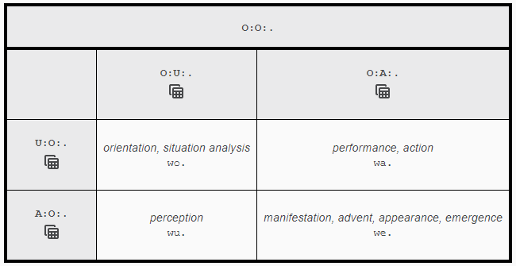

# Sensory-Motor Cycle

Overall the system models the sensory-motor cycle. But in a way that allows for reusable infrastructure and tooling built for it.

[This presentation](https://www.icloud.com/photos/#0e05LRBRTStqtM5rm1xL2wZKg) touches on the sensory-motor cycle too.

## Overview

```mermaid
graph LR
A["🌍 Reality"] -->|observe| B["👀 Percepts"]
B -->|interpret| C["🧠 Imagination"] 
C -->|decide| D["👋 Intervention"]
D -->|act| A
```

This diagram represents the sensory-motor cycle in a clear and concise manner using emojis to illustrate the different components. The flow of information is indicated by the arrows between each component, with the cycle starting and ending with the external environment or **🌍 Reality**. Here's a breakdown of each component:

- **🌍 Reality**: represents the external environment, which provides the sensory inputs that drive the sensory-motor cycle.
- **👀 Percepts**: represents the perception of sensory inputs, which are processed by the brain to create _percepts_.
- **🧠 Imagination**: represents the cognitive processing of percepts, which leads to the formation of mental representations and _imagination_.
- **👋 Intervention**: represents the motor output or _interventions_ generated based on the cognitive processing of percepts and imagination.
- The arrows between each component represent the flow of information, starting with the observation of sensory inputs, followed by their interpretation and cognitive processing, leading to the generation of motor output and ultimately resulting in a change in the external environment.

## Formalization

In [IEML](https://intlekt.io/ieml/), the sensory-motor cycle can be found in the Virtual/Actual Binary Symmetry, also called _Interaction Phases_, which consists of four words:

| Human Emoji | Machine Emoji | IEML USL | English verb | English noun |
| ----------- | ------------- | -------- | ------------ | ------------ |
| 👀 | 📸 | `wu.` = `A:U:E:.` | perceive | percept
| 🧠 | 🌐 | `wo.` = `U:U:E:.` | orient | orientation
| 👋 | 🦾 | `wa.` = `U:A:E:.` | act | action
| 🌍 | 🌍 | `we.` = `A:A:E:.` | appear | appearance

To understand the IEML USLs (Uniform Semantic Locator), read about the [six semantic primitives](https://intlekt.io/semantic-primitives/) and the [constriction of words](https://intlekt.io/elements/) in IEML.

Here's the sensory-motor cycle as seen in the tabular view in the [IEML Editor](https://ieml.intlekt.io):

Note the two intertwined oppositions:

|                                  |                                     |
| -------------------------------- | ----------------------------------- |
| `wa.` _act_ (inside → outside)   | `wu.` _perceive_ (outside → inside) |
| `wo.` _orient_ (inside → inside) | `we.` _appear_ (outside → outside)  |

To understand its meaning, we must relate to the fundamental sensory-motor cycle. Let us begin with the virtual act of orientation, which takes place in the mind (`wo.`). From this virtual place we act (`wa.`). As a result, our current environment is transformed and a new reality manifests itself (`we.`). Finally, from the actuality of the external event, we perceive (`wu.`) by a return to interiority. [[source](https://intlekt.io/25-basic-categories/)]

Here a version of the sensory-motor diagram adapted to machines:

```mermaid
graph LR
A["🌍 Reality"] -->|observe| B["📸 Percepts"]
B -->|interpret| C["🌐 Scene"] 
C -->|decide| D["🦾 Intervention"]
D -->|act| A
```

For more context on how this relates to machine learning and artificial intelligence, take a look at the **IEML Neuro-Semantic Architecture** described in [this essay from Pierre Lévy](https://intlekt.io/2022/01/18/ieml-towards-a-paradigm-shift-in-artificial-intelligence/).

## Appear - Reality 🌍

Represents external systems not in direct control of the Askbot operator. Examples include exchanges, distributed ledgers, externally hosted REST APIs, or the physical world itself, accessible through sensors only.

All these systems have some inherent behavior. An exchange, for example, does order matching in a fairly predictable way. Or physics enforces gravity according to some fairly constant mechanisms. But the rules that govern those systems and the state they are in are only indirectly accessible to an Askbot instance.

Rules of behavior can be inferred from public documentation, scientific experiments, or open source code.

Historic system states can be inferred from observing those systems through their public interaction interface.

## Perceive - Observations 👀📸

To better reason about the state of external systems, the SDK defines **Observers**.

Observers communicate with the computer networks related to relevant external systems in an effort to extract and capture information about it's internal state and behavior.

In case of an exchange, it may listen to order book updates via a WebSocket connection.

In case of a Blockchain, it may connect to the p2p network and records all gossiped transactions and blocks.

## Orient - Interpretation 🧠🌐

It is important to recognize that those captured percepts are not synonymous with the state of the external system. In most cases, the state itself is not directly accessible.

Therefore, there is some reconstruction to be done to convert captured percepts into a local imaginative state of the system. for this, the SDK defines **Interpreters**, which .

This is done on a best-effort bases with pragmatism in mind. Only relevant state must be computationally reconstructed, as defined by the **Strategy** that derives decisions from it. Secondly, the rules with which that state is computed may not exactly match the behavior of the system. In some cases this imprecision does not matter. In other cases it does, where it is an iterative process to fine tune the rules so that all captured percepts are in line with the modelled behavior (i.e. there are no inconsistencies).

## Act - Causal Interventions 👋🦾

Finally, we have the action phase of the cycle. Acting is the way to have causal influence on external systems. What actions are available and what influence they end up having depends on the model of reality that is relevant and in use.

For example, a limit order can be sent to an exchange. Although there are certain expectations of what might happen, it really is up to the external system to decide. And whatever ends up manifesting, it can again only indirectly be observed through percepts. And so the sensory-motor cycle repeats.

To manage action execution, the SDK defines **Brokers**.

## Ontology

For a more detailed breakdown of the sensory-motor cycle which tremendously infleunced the development of AskFi, take a look at the underlying ontology [here](ontology.md).
