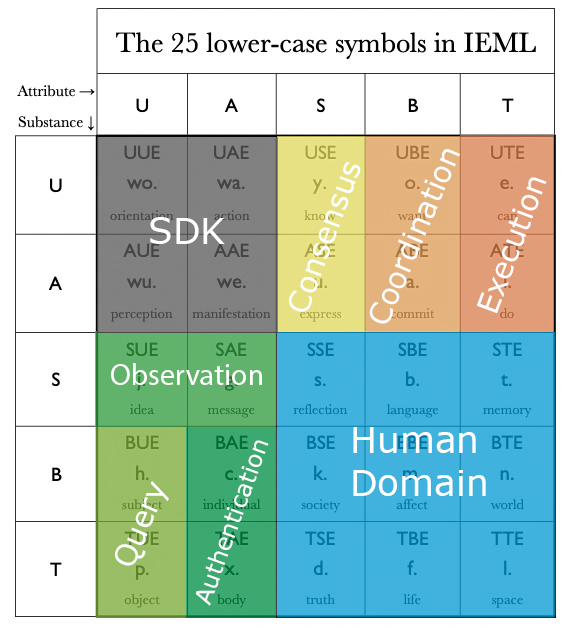

# Sensory-Motor Cycle

Overall the system models the sensory-motor cycle. But in a way that allows for reusable infrastructure and tooling built for it.

A presentation about this can be watched [here](https://www.icloud.com/photos/#0e05LRBRTStqtM5rm1xL2wZKg).

In [IEML](https://intlekt.io/ieml/), the sensory-motor cycle can be found in the Virtual/Actual Binary Symmetry, also called _Interaction Phases_ and looks like this:

To understand its meaning, we must relate to the fundamental sensory-motor cycle. Let us begin with the virtual act of orientation, which takes place in the mind (wo.). From this virtual place we act (wa.). As a result, our current environment is transformed and a new reality manifests itself (we.). Finally, from the actuality of the external event, we perceive (wu.) by a return to interiority. [[source](https://intlekt.io/25-basic-categories/)]

Note the two intertwined oppositions:

|                                  |                                     |
| -------------------------------- | ----------------------------------- |
| `wa.` _act_ (inside → outside)   | `wu.` _perceive_ (outside → inside) |
| `wo.` _orient_ (inside → inside) | `we.` _appear_ (outside → outside)  |

For more context on how this relates to machine learning and artificial intelligence, take a look at the **IEML Neuro-Semantic Architecture** described in [this essay](https://intlekt.io/2022/01/18/ieml-towards-a-paradigm-shift-in-artificial-intelligence/).

## Appear - External Systems

Represents external systems not in direct control of the Askbot operator. Examples include exchanges, distributed ledgers, externally hosted REST APIs, or the physical world itself, accessible through sensors only.

All these systems have some inherent behavior. An exchange, for example, does order matching in a fairly predictable way. But the rules that govern those systems and the state they are in are only indirectly accessible to an Askbot instance.

Rules of behavior can be inferred from public documentation, scientific experiments, or open source code.

Historic system states can be inferred from observing those systems through their public interaction interface.

## Perceive - Observations

To better reason about the state of external systems, the SDK defines **Observers**.

Observers communicate with the computer networks related to an external system in an effort to extract and record information about it's internal state.

In case of an exchange, it may listen to order book updates via a WebSocket connection.

In case of a Blockchain, it may connect to the p2p network and records all gossiped transactions and blocks.

## Orient - Semantic Transformations

It is important to realize that those recorded percepts are not synonymous with the state of the external system. In most cases, the state itself is not directly accessible.

Therefore, there is some reconstruction to be done to convert recorded percepts into a local imaginative state of the system. for this, the SDK defines **Interpreters**.

This is done on a best-effort bases with pragmatism in mind. Only relevant state must be computed, as defined by the trading strategy. Secondly, the rules with which that state is computed may not exactly match the behavior of the system. In some cases this imprecision does not matter. In other cases it does, where it is an iterative process to fine tune the rules so that all recorded observations are in line with the modelled behavior (i.e. there are no inconsistencies).

## Act - Causal Interventions

Finally, we have the action phase of the cycle. Acting is the way to have causal influence on external systems. What actions are available and what influence they end up having depends on the external system.

For example, a limit order can be sent to an exchange. Although there are certain expectations of what might happen, it really is up to the external system to decide. And whatever ends up manifesting, it can again only indirectly be observed through percepts. And so the sensory-motor cycle repeats.

To manage action execution, the SDK defined **Brokers**.

## Ontology

The four phases  **manifestation -> perception -> orientation -> action** can be further broker up by means of the two Hexads _Actors_ (green) and _Actions_ (yellow):

So far, this is just standard IEML and nothing unique to AskFi.

Read more about the six semantic primitives **Virtual, Actual, Sign, Being, Thing, Emptiness** [here](https://intlekt.io/semantic-primitives/).

Read more about the 25 lowercase symbols in IEML [here](https://intlekt.io/25-basic-categories/).

While these are useful and ubiquitus categories, for the sake of implementation, AskFi groups the IEML alphabet into eight domains of implementation: **SDK, Observation, Query, Authentication, Execution, Coordination, Consensus, and Human Domain**:

